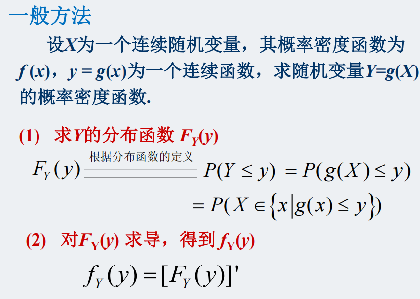
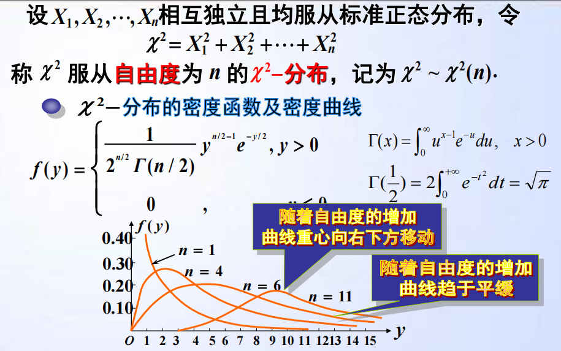
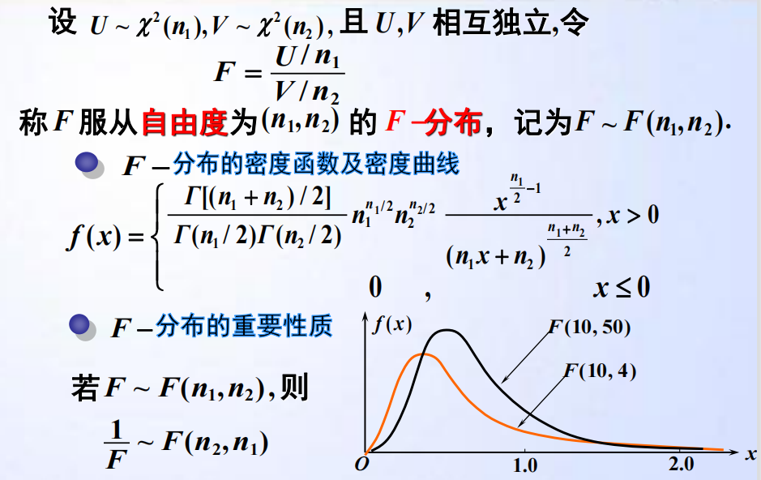
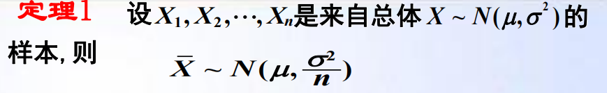

## 概率论与数理统计

### 第1章

1. $A-B=A-AB=A\overline{B}$

​		$A\cup B=A+B-AB=A\cup \overline{A}B$

2. 选排列：$P_n^k=n(n-1)...(n-k+1)=\frac{n!}{(n-k)!}$

​		全排列：$P_n^n=n!$

​		组合：$C_n^k=\frac{P_n^k}{P_k^k}$

##### 事件运算规律：交换律、结合律、分配率、对偶律（德摩根定律）

##### 古典概型：

古典概型：==样本空间有限；等可能==

> 求解这类概率问题时，重要的是求出基本事件总数和所求事件的总数，有时候需要巧妙转换问题
>
> 

##### 几何概型：

==可度量性，等可能性==

> 

##### 概率公理化：

非负性；规范性（和为1）；可列可加性；

##### 概率的性质：

1. 若$A\subset B$，则$P(B-A)=P(B)-P(A)$。

2. $P(A\cup B)=P(A)+P(B)-P(AB)$.

3. $P(B-A)=P(B)-P(AB)$.

4. 

   $\begin{aligned} & P\left(A_{1} \cup A_{2} \cup A_{3}\right)=? \\=& P\left(A_{1}\right)+P\left(A_{2}\right)+P\left(A_{3}\right) -P\left(A_{1} A_{2}\right)-P\left(A_{1} A_{3}\right)-P\left(A_{2} A_{3}\right)  +P\left(A_{1} A_{2} A_{3}\right) \end{aligned}$

   

   $P\left(A_{1} \cup A_{2} \cup \cdots \bigcup A_{n}\right)=\sum_{i=1}^{n} P\left(A_{i}\right)-\sum_{1 \leq i<j \leq n} P\left(A_{i} A_{j}\right)$
   $+\sum_{1 \leq i<j<k \leq n} P\left(A_{i} A_{j} A_{k}\right)+\cdots+(-1)^{n-1} P\left(A_{1} A_{2} \cdots A_{n}\right)$
   
5. 不相容：互斥

### 第2章、条件概率与独立性

##### 条件概率：

$P(A|B)=\frac{P(AB)}{P(B)}$.

> **区分$P(AB)$和$P(A|B)$:**
>
> $P(AB)$样本空间为整体，$P(A|B)$样本空间为B；
>
> $P(A|B)>p(AB)$

##### 乘法定理：

$P(AB)=P(B|A)P(A)$.

##### 全概率公式

$P(B)=\sum_{i=1}^{n} P\left(A_{i}\right) P\left(B \mid A_{i}\right)$

其中A~1~,A~2~,A~3~....A~n~构成一个完备事件组

##### 贝叶斯公式

（全概率公式的逆问题）

$P\left(A_{k} \mid B\right)=\frac{P\left(A_{k} B\right)}{P(B)}=\frac{P\left(A_{k}\right) P\left(B \mid A_{k}\right)}{\sum_{i=1}^{n} P\left(A_{i}\right) P\left(B \mid A_{i}\right)}$。

其中A~1~,A~2~,A~3~....A~n~构成一个完备事件组

##### 两事件的独立性

定义：$P(AB)=P(A)P(B)$.

==定理==：

​	（1）A与B	（2）A与B'	（3）A'与B	（4）A'与B'	<=>   	（1）$P(AB)=P(A)P(B)$	（2）$P(B)=P(B|A)=P(B|\overline A)$.

​	这四组事件的独立性相同

多组事件相互独立的条件：

> 

##### 贝努力概型

（n重二项分布）

$P_{n}(k)=C_{n}^{k} p^{k} q^{n-k}$。

##### 二项概率的泊松近似

$C_{n}^{k} p^{k}(1-p)^{n-k} \approx \frac{\lambda^{k}}{k !} e^{-\lambda}$（$\lambda$=np）

1. $\sum_{k=16}^{2400}\frac{5^k}{k!}e^{-5}\approx\sum_{k=16}^{\infty}\frac{5^k}{k!}e^{-5}$.（后者查表可知）

##### 第1、2章做题总结

1. ==仅==给出概率是无法得出事件的结论的

   即：只有P(AB)=0，不能得出AB为空

2. ​	（1）A与B	（2）A与B'	（3）A'与B	（4）A'与B'	<=>   	（1）$P(AB)=P(A)P(B)$	（2）$P(B)=P(B|A)=P(B|\overline A)$.

3. 在利用全概率公式求解问题时，以**样本来源**作为完备事件组往往要比以**样本数量**作为完备事件组要好（需要结合第二问）

4. 计算条件概率是可采用缩减样本空间的方法

### 第3章

#### 1、离散型随机变量

> 有限多个或可数无穷多个

1. 分布列的表示：公式法，表格法。（必须涵盖X的所有可能的取值，同时满足规范性）

#### 2、连续性随机变量

##### ==分布函数：==

1. 单调不减
2. $F(-\infty)=0;\  \ F(+\infty)=1$.
3. 右连续：$F(x+0)=F(x)$.（所以在离散型随机变量的分布函数中区间一般左闭右开）

> 这3点同时也是判断一个函数能否作为分布函数的条件

##### ==密度函数：==

1. 非负性：$f(x)\geqslant 0, \forall x \in (-\infty,+\infty)$.
2. 规范性：$\int_{-\infty}^{+\infty}f(x)dx=1$.

> 这两点也是判断一个函数能否作为密度函数的条件

$F(x)=P(X\leq x)=\int_{-\infty}^{x}f(x)dx$.

#### 3、几种分布：

离散型：

##### 1、二项分布：$X\sim B(n,p)$

$$
\begin{array}{r}
P\{X=k\}=C_{n}^{k} p^{k}(1-p)^{n-k} \\
k=0,1,2 \ldots, n
\end{array}
$$

> 二项分布在k=(n+1)p为正整数时P(X=k)在k=(n+1)p和k=(n+1)p-1时都取得最大值；若(n+1)p不是整数，则P(X=k)在k=[(n+1)p]（即整数部分）时取得最大值。

##### 2、泊松分布：$X\sim P(\lambda)$

$$
P(X=k)=\frac{\lambda^{k}}{k !} e^{-\lambda}, k=0,1,2 \ldots
$$

> 相对小的物质在较大空间内的稀疏分布可以看作泊松分布，其参数$\lambda$可以由观测值的平均值求出
>
> 注意k是从0开始的
>
> 附表1是泊松分布累积概率值表（从k到无穷）

##### 3、几何分布：$：X\sim G(p)$

$$
P\{X=k\}=(1-p)^{k-1} p, \quad k=1,2, \cdots
$$

> 进行了k次独立实验，到第k次才成功（发生）
>
> 无记忆性：$P\{X>n+m\ |\ X>n\}=P(X>m)$.

##### 4、负二项分布（几何分布的一般化）：$X\sim NB(r,p)$

$$
\begin{aligned}
P\{X=k\}=C_{k-1}^{r-1} p^{r}(1-p)^{k-r} & \\
k=r, r+1, r+2, \cdots &
\end{aligned}
$$

> 连续独立实验直到成功r次为止

##### 5、超几何分布（与二项分布区别：不放回）：

$$
\begin{aligned}
P\{X=k\}=& \frac{C_{M}^{k} C_{N-M}^{n-k}}{C_{N}^{n}} \\
& k=0,1,2, \cdots, \min \{M, n\}
\end{aligned}
$$

> 当样本足够大时，超几何分布近似于二项分布（少了一个几乎无影响，相当于放回）

连续型：

##### 1、均匀分布：$X\sim U(a,b)$.

$$
f(x)=\left\{\begin{array}{l}
\frac{1}{b-a} \ a<x<b \\
0 \text { 其它 }
\end{array}\right.
$$

$$
F(x)=\left\{\begin{array}{l}
0，\  \ x\leqslant a\\
\frac{x-a}{b-a}，a<x<b\\
1, \ \ x\geqslant b
\end{array}\right.
$$

##### 2、指数分布：$X\sim E(\lambda)$

$$
f(x)=\left\{\begin{array}{ll}
\lambda e^{-\lambda x} & x>0 \\
0 & x \leq 0
\end{array}(\lambda>0 \text { 为常数 })\right.
$$

$$
F(x)= \begin{cases}0 & x \leq 0 \\ 1-e^{-\lambda x} & x>0\end{cases}
$$

> 指数分布的无记忆性

#### 4、正态分布：$X\sim B(\mu,\sigma^2)$

$$
f(x)=\frac{1}{\sqrt{2 \pi} \sigma} e^{-\frac{(x-\mu)^{2}}{2 \sigma^{2}}},(\mu, \sigma>0)
$$

> $\mu$表示对称轴位置
>
> $\sigma$越小图像越陡（说明大多数都接近$\mu$，方差小）；$\sigma$越大图像越平缓

1. X,Y服从正态分布的话，那么只要变化系数行列式（雅可比行列式）不为0，那么新的线性变化依然服从二维正态分布。
2. X，Y均服从标准正态分布，则X+Y与(X-Y)^2^独立

##### 1、标准正态分布

$ \Phi(-x)=1-\Phi(x)$.

##### 2、状态分布标准化

$F(x)=\Phi(\frac{x-\mu}{\sigma})$.

#### 5、随机变量函数的分布

离散型：求出分布列，合并相同项

连续性：

> 

==定理1：==
$$
X\sim N(\mu,\sigma^2),Y=aX+b(a\neq 0),则
\\ Y\sim N(a\mu+b,(a\sigma)^2)
$$
==定理2：==

**若g(x)为严格单调可微函数： **
$$
\\ f_Y(y)=f_X[G(y)]|G'(y)|
\\ 其中，x=G(y)为y=g(x)的反函数。
$$
==定理3：==

设$X\sim N(0,1)$，则$Y=X^2$的概率密度函数为：
$$
f_{Y}(y)=\left\{\begin{array}{cl}
\frac{1}{\sqrt{2 \pi}} y^{-\frac{1}{2}} e^{-\frac{y}{2}}, & y>0 \\
0, & y \leq 0
\end{array}\right.
$$

> 自由度为1的$\chi^2$分布

#### 第三章做题总结

1. 随机变量X和-X具有相同的概率密度，则二者同分布，且F(X)+F(-X)=1
2. 对任一连续型随机变量X其分布函数为F(x)，则$Y=F(X)$必定服从$U(0,1)$
3. 

### 第4章、多维随机变量及其分布

#### 1、联合分布函数

##### 性质：

> 

> 性质4不能由前3条性质推出，故在定义一个二元函数时性质4不能省
>
> 随机变量的边际分布完全由它们的联合发布决定，反之不成立
>
> $F(-\infty,+\infty)=F(+\infty,-\infty)=0$.求分布函数系数时可能会用到

#### 2、二维离散型随机变量

1. $\sum \sum P_{ij}=1$
2. $P_{ij}\geq 0 $

边际分布$P_{i \centerdot }=\sum_{j=1}^{\infty}P_{ij}$

#### 3、二维连续性随机变量

$$
F(x,y)=\int_{-\infty}^{x}\int_{-\infty}^{y}f(u,v)dudv\  \ (\forall(x,y)\in R^2)
$$

##### 性质：

1. $f(x,y) \geq 0 \ (\forall(x,y)\in R^2)$ 
2. $\int_{-\infty}^{+\infty}\int_{-\infty}^{+\infty}f(u,v)dudv =1$
3. $\forall(D) \subset R^{2}$
   $P\{(X, Y) \in D\}=\iint_{D} f(x, y) d x d y$
4. 在f(x,y)的连续点处，有$\frac{\partial^2F(x,y)}{\partial x\partial y}=f(x,y)$

##### 边际分布和边际密度函数：

$F_{X}(x)=P\{X\leq x\}=\int_{-\infty}^{x}(\int_{-\infty}^{+\infty}f(u,y)dy)du$

$f_X(x)=\int_{-\infty}^{+\infty}f(x,y)dxdy$

##### 二维均匀分布

联合密度函数满足均匀分布时，边际密度函数不一定也满足均匀分布

##### 二维正态分布$(X,Y)\sim N(\mu_1,\mu_2,\sigma_1^2,\sigma_2^2,\rho)$

$$
f(x, y)=\frac{1}{2 \pi \sigma_{1} \sigma_{2} \sqrt{1-\rho^{2}}} e^{-\frac{1}{2\left(1-\rho^{2}\right)}\left[\frac{\left(x-\mu_{1}\right)^{2}}{\sigma_{1}^{2}}-2 \rho \frac{\left(x-\mu_{1}\right)\left(y-\mu_{2}\right)}{\sigma_1 \sigma_2}+\frac {\left(y-\mu_{2}\right)^{2}}{\sigma_2^2}\right]}
$$

==定理：==若$(X,Y)\sim N(\mu_1,\mu_2,\sigma_1^2,\sigma_2^2,\rho)$，则$X\sim N(\mu_1,\sigma_1^2),\ \ Y\sim N(\mu_2,\sigma_2^2)$。X与Y相互独立的充分必要条件是$\rho=0$.

> 而边际密度函数不能确定联合分布

#### 4、随机变量的独立性

若$P\{X\leq x,Y \leq y\}=P\{X \leq x\}P\{Y \leq y\}$，即：$F(x,y)=F_X(x)F_Y(y) \Longleftrightarrow f(x,y)=f(x)f(y)$

则称随机变量X，Y相互独立

#### 5、条件分布

##### 条件分布列：

$$
P\{X=x_i|Y=y_j\}=\frac{P_{ij}}{P{.j}}\\
P\{Y=y_j|X=x_i\}=\frac{P_{ij}}{P{i.}}
$$

> 1. $P\{X=x_i|Y=y_i\}\geq 0$
> 2. $\sum_{i=1}^{\infty}P\{X=x_i|Y=y_i\}=\sum_{i=1}^{\infty}\frac{P_{ij}}{P_{.j}}=1$
>
> 这说明条件分布列也是一种分布列

##### 二维随机变量的条件概率密度：

$$
f_{X|Y}(x|y)=\frac{f(x,y)}{f_Y(y)}(-\infty<x<+\infty) \ \ \  \ \ \ \ \ \  \ 称为在Y=y的条件下，X的概率密度 \\
F_{X|Y}(x|y)=\int_{-\infty}^{x}f_{X|Y}(u|v)du(-\infty<x<+\infty) \ \ \  \ \ \ \ \ \  \ 称为在Y=y的条件下，X的条件分布(函数) \\
$$

> 同条件分布列，条件密度也是一种密度

若随机变量X，Y相互独立，则$f_{X|Y}(x|y)=\frac{f(x,y)}{f_Y(y)}=\frac{f_X(x)f_Y(y)}{f_Y(y)}=f_X(x)$

#### 5、二维随机变量函数的分布

$$
\begin{aligned}
\boldsymbol{F}_{\boldsymbol{Z}}(\boldsymbol{z}) &=\boldsymbol{P}\{\boldsymbol{Z} \leq \boldsymbol{z}\}=\boldsymbol{P}\{\boldsymbol{X}+\boldsymbol{Y} \leq \boldsymbol{z}\} \\
&=\iint_{\boldsymbol{x}+\boldsymbol{y}\leq z} \boldsymbol{f}(\boldsymbol{x}, \boldsymbol{y}) \boldsymbol{d} \boldsymbol{x} \boldsymbol{d} \boldsymbol{y}
\end{aligned}
$$

所以Z=X+Y的概率密度为：
$$
f_Z(z)=\int_{-\infty}^{+\infty}f(x,z-x)dx=\int_{-\infty}^{+\infty}f(z-y,y)dy
$$

若X，Y相互独立，则Z=X+Y的密度函数为：
$$
\begin{aligned}
f_{Z}(z) &=\int_{-\infty}^{\infty} f_{X}(z-y) f_{Y}(y) d y \\
f_{Z}(z) &=\int_{-\infty}^{\infty} f_{X}(x) f_{Y}(z-x) d x
\end{aligned}
$$
称为卷积公式，$f_Z(z)=f_X*f_Y$

##### 伽马分布与指数分布以及卡方分布的关系

> 若X，Y服从参数为$\lambda$的指数分布，则Z=X+Y服从$\Upgamma(2,\lambda)$的伽马分布
>
> 更一般的有，n个指数分布的和服从$\Upgamma(n,\lambda)$的伽马分布
>
> 同时，若两独立变量X，Y有$X\sim \Upgamma(\alpha,\lambda),\ Y\sim \Upgamma(\upbeta,\lambda)$，则 $X+Y\sim \Upgamma(\alpha+\upbeta,\lambda)$
>
> 
>
> **伽马分布的概率密度**为：
> $$
> f(X)=\frac{X^{(\alpha-1)} \lambda^{\alpha} e^{(-\lambda X)}}{\Gamma(\alpha)}, X>0
> $$
> $\Gamma(x)=\int_{0}^{\infty} u^{x-1} e^{-u} d u, \quad x>0$
>
> 其中：$\Upgamma (1)=1, \ \Upgamma(1/2)=\sqrt{\uppi},\ \Upgamma(x+1)=x\Upgamma(x),\ \Upgamma(n)=(n-1)!$
>
> 易知：对于伽马分布$X\sim \Upgamma(\alpha,\lambda)$有，当$\alpha$为1是，伽马分布为指数分布；当$\alpha$是n/2，$\lambda$是1/2时，伽马分布为卡方分布

##### 多维随机变量函数的正态分布：

独立正态分布随机变量的非零线性组合仍服从正态分布
$$
a_{1} X_{1}+a_{2} X_{2}+\cdots+a_{n} X_{n} \sim N\left(\sum_{i=1}^{n} a_{i} \mu_{i}, \sum_{i=1}^{n} a_{i}^{2} \sigma_{i}^{2}\right)
$$

##### 离散型多维随机变量函数的分布：

$$
\begin{aligned}
P\{Z=\boldsymbol{k}\} &=P\{\boldsymbol{X}+\boldsymbol{Y}=\boldsymbol{k}\} \\
&=\sum_{i=1}^{k} P\{X=\boldsymbol{i}\} \cdot P\{Y=\boldsymbol{k}-\boldsymbol{i}\} \\
&=\sum_{i=1}^{k} P\{X=\boldsymbol{k}-\boldsymbol{i}\} \cdot P\{Y=\boldsymbol{i}\},(\boldsymbol{k}=1,2, \ldots)
\end{aligned}
$$

> 

##### min/max(X,Y)

> 
>
> 
>
> 

#### 第四章做题总结：

1. 在离散型随机变量中，当X与Y独立，则(X,Y)分布的概率行与行之间成比例，同样，列与列之间成比例。因此，如果在(X,Y)的分布律中有一个$p_{ij}=0$，则可以肯定X与Y不是相互独立的。反之不一定，即如果有$p_{ij}\neq0$并不能保证X与Y独立。
2. $Z=max(X,Y)$是一维随机变量，其分布函数只可能是一元函数F^2^(x)，不可能是二元函数F(x)F(y)。
3. 求概率密度和分布函数时要时刻注意==变量范围==
4. 重要积分公式：$\int_{-\infty}^{+\infty}e^{-x^2}dx=\sqrt{\pi}$
5. 在求条件概率密度时必须先说明分母大于0
6. 积分时应充分利用==奇偶性和对称性==

### 第5章、随机变量的数字特征

#### 1、数学期望

##### **离散型：**

​	若级数$\sum_{k=1}^{\infty}|x_k|p_k<+\infty$（绝对收敛），则称
$$
E(X)=\sum_{k=1}^{\infty}x_k p_k=\sum_{k=1}^{\infty}x_k P\{X=x_k\}
$$
​	为随机变量X的数学期望

##### 连续型：

​	若$\int_{-\infty}^{+\infty}|x|f(x)dx<+\infty$（绝对收敛），则称
$$
E(X)=\int_{-\infty}^{+\infty}xf(x)dx
$$
​	为随机变量X的数学期望

​	（Cauchy分布的数学期望和矩估计都不存在）

##### 常见随机变量的数学期望和方差

1. 0-1分布：$E(X)=p,\ \ D(X)=p(1-p)$
2. 二项分布：$E(X)=np,\ \ D(X)=np(1-p)$
3. 泊松分布：$E(X)=\lambda,\ \ D(X)=\lambda$
4. 几何分布：$E(X)=\frac1p,\ \ D(X)=\frac{1-p}{p^2}$
5. 均匀分布：$E(X)=\frac{a+b}{2},\ \ D(X)=\frac{(b-a)^2}{12}$
6. 指数分布：$E(X)=\frac1{\lambda},\ \ D(X)=\frac1{\lambda^2}$
7. 正太分布：$E(X)=\mu,\ \ D(X)=\sigma^2$

##### 随机变量的函数的数学期望

==定理1：==若$\int_{-\infty}^{+\infty}|g(x)|f(x)dx<+\infty$（绝对收敛），则称
$$
E(Y)=\int_{-\infty}^{+\infty}g(x)f(x)dx
$$
​	为随机变量Y=g(x)的数学期望

> 离散型的类似

==定理2：==若$\int_{-\infty}^{+\infty}\int_{-\infty}^{+\infty}|g(x,y)|f(x,y)dxdy<+\infty$（绝对收敛），则称
$$
E(Z)=E[g(X,Y)]=\int_{-\infty}^{+\infty}\int_{-\infty}^{+\infty}g(x,y)f(x,y)dxdy
$$
​	为随机变量Z=g(X,Y)的数学期望

##### 数学期望的基本性质：

> 

#### 2、方差和标准差

$$
D(X)=E\{[X-E(X)]^2\}=\sum_{k=1}^{\infty}[x_k-E(X)]^2 \cdot p_k=\int_{-\infty}^{+\infty}[x-E(X)]^2f(x)dx
$$

$$
D(X)=E(X^2)-[E(X)]^2
$$

##### 基本性质

1. 随机变量恒为常数，则$D(X)=0$
2. $D(cX)=c^2D(X)$
3. $D(X\pm Y)=D(X)+D(Y)\pm 2E\{[X-E(X)][Y-E(Y)]\}$

​		特别的，当X与Y独立时有$D(X\pm Y)=D(X)+D(Y)$

#### 3、协方差与相关系数 矩

$$
Cov(X,Y)=E\{[X-E(X)][Y-E(Y)]\}=E(XY)-E(X)E(Y)
$$

##### 协方差的性质

1. $Cov(X,Y)=Cov(Y,X)$
2. $Cov(X,X)=E[X-E(X)]^2=D(X)$
3. $Cov(aX,bY)=abCov(X,Y)$
4. $Cov(X+Y,Z)=Cov(X,Z)+Cov(Y,Z)$
5. $D(X\pm Y)=D(X)+D(Y)\pm 2Cov(X,Y)$

> 

##### 相关系数

$$
\rho_{XY}=\frac{Cov(X,Y)}{\sqrt{D(X)}\sqrt{D(Y)}}
$$

> 1. $|\rho_{XY}|\leq 1$
> 2. $|\rho_{XY}|=1$，说明X与Y线性相关，$Y=aX+b$

##### 几个等价结论（不相关）

1. $\rho_{XY}=0$
2. $Cov(X,Y)=0$
3. $D(X+Y)=D(X)+D(Y)$
4. $E(XY)=E(X)E(Y)$

##### 独立与不相关

==独立的条件强于不相关==(不相关的定义：$\rho_{XY}=0$)

> 

##### 矩与协方差矩阵

>

#### 4、大数定理

##### 依概率收敛

设$X,X_1,X_2,...X_n,...$是一列随机变量，若$\forall \mathcal{E}>0$有
$$
\lim\limits_{n\to+\infty}P\{|X_n-X|<\mathcal{E}\}=1
$$
则称{X~n~}依概率收敛于X，$X_n\stackrel{P}{\longrightarrow}X$

##### 切比雪夫不等式

$$
P\{|X-\mu|\geq \mathcal{E}\} \leq \frac{\sigma^2}{\mathcal{E}^2}
\\P\{|X-\mu| < \mathcal{E}\} \geq 1- \frac{\sigma^2}{\mathcal{E}^2}
\\ 变式？：P\{|X-C| \geq\mathcal{E}\}\leq \frac{E|X-C|^2}{\mathcal{E}^2}
$$

> 小扩展：马尔可夫不等式：$P(X>\mathcal{E})\leq\frac{E(X)}{\mathcal{E}}$

##### 切比雪夫大数定理

$$
\lim\limits_{n\to+\infty}P\{|\frac1n \sum_{i=1}^{n}X_i-\frac1n \sum_{i=1}^{n}E(X_i)|\geq \mathcal{E}\}=0
$$

> 前提：随机变量两两不相关，方差和均值都存在

##### 伯努利大数定律（$X_n \sim B(n,p)$）

$$
\lim\limits_{n\to+\infty}P\{|\frac{n_A}{n}-p|\geq\mathcal{E}\}=0
$$

> 前提：n重实验相互独立，方差存在

##### 辛钦大数定律

$$
\lim\limits_{n\to+\infty}P\{|\frac1n \sum_{i=1}^{n}X_i-\mu|\geq \mathcal{E}\}=0
$$

> 各随机变量独立同分布

#### 5、中心极限定理

##### 棣莫弗—拉普拉斯中心极限定理

n充分大后，服从二项分布的随机变量标准化后服从标准正态分布
$$
\lim\limits_{n \to+\infty}P\{\frac{X_n-np}{\sqrt{np(1-p)}}\leq x\}=\Upphi(x)
$$

##### 列维—林德伯格中心极限定理

仅需独立同分布，数学期望为$\mu$，方差为$\sigma^2$
$$
\lim\limits_{n \to+\infty}P\{\frac{\sum_{i=1}^{n}X_i-n\mu}{\sqrt{n}\sigma}\leq x\}=\Upphi(x)
$$

> 近似有：
>
> $\sum_{i=1}^nX_i \sim N(n\mu,n\sigma^2)$
>
> $\frac1n\sum_{i=1}^nX_i\sim N(\mu,\frac{\sigma^2}{n})$

#### 第5章做题总结

1. 若$F(x)=C_1\Upphi(\frac{x-\mu_1}{\sigma_1})+C_2\frac{x-\mu_2}{\sigma_2}, \ C_1+C_2=1$，则必有	$EX=C_1\mu_1+C_2\mu_2$

2. $$
   max\{X,Y\}=\frac{X+Y+|X-Y|}{2}
   \\ min\{X,Y\}=\frac{X+Y-|X-Y|}2
   \\
   \\ max\{X,Y\}\cdot min\{X,Y\}=XY
   \\ max\{X,Y\}+min\{X,Y\}=X+Y
   \\
   \\若X,Y\sim E(\lambda)
   \\ 则min\{X,Y\}\sim E(2\lambda)
   $$
   
3. 在求概率密度函数或分布函数时，关键在于判断其变量部分的结构，若能**判断出所求函数是某种分布的分布函数或概率密度函数**，则计算将会简化许多

4. ==积分时应充分利用奇偶性和对称性==

5. X,Y服从正态分布的话，那么只要变化系数行列式（雅可比行列式）不为0，那么新的线性变化依然服从二维正态分布。

6. ==求函数表达式时记得分段！！！==

6. 利用切比雪夫不等式计算时要注意不等式的方向，有时需要用1减去所得值

### 第6章、数理统计基本概念

#### 1、总体与样本

总体：有限与无限

> 
>
> 

#### 2、直方图

> 
>
> ==$f(t_i) \approx \frac{n_i}{n \bigtriangleup t_i}$==
>
> 做到每一组的数据均不为空

#### 3、经验分布函数

> 
>
> 

注：$\alpha $分位点概念

> 

#### 4、$\chi^2-$分布

> 

1. ==可加性==

   $\chi^2_1 \sim \chi^2(n_1),\chi^2_2 \sim \chi^2(n_2)$，且$\chi^2_1$和$\chi^2_2$**相互独立**，则$\chi^2_1+\chi^2_2 \sim \chi^2(n_1+n_2)$.

2. 数字特征（==方差、期望==）

   $E(\chi^2)=n,D(\chi^2)=2n$.

3. $\alpha $分位点.

   $P(\chi^2>\chi^2_\alpha(n))=\alpha$
   
4. 当n充分大时，$\chi_{\alpha}^2(n) \approx \frac 12(u_{\alpha}+\sqrt{2n-1})^2 $

**伽马分布的概率密度**为：
$$
f(X)=\frac{X^{(\alpha-1)} \lambda^{\alpha} e^{(-\lambda X)}}{\Gamma(\alpha)}, X>0
$$
$\Gamma(x)=\int_{0}^{\infty} u^{x-1} e^{-u} d u, \quad x>0$

> 当$\alpha$为n/2，$\lambda$为1/2时，f(X)为卡方分布的概率密度
>
> $\chi^2 \sim \Gamma(\frac n2,\frac 12)$.
>
> $\Upgamma (1)=1, \ \Upgamma(1/2)=\sqrt{\uppi},\ \Upgamma(x+1)=x\Upgamma(x),\ \Upgamma(n)=(n-1)!$，详见4.5伽马分布的介绍

#### 5、$t-$分布

> 

>
>
>

1. 数字特征（==方差、期望==）

   $E(t)=0,D(t)=\frac{n}{n-2}(n>2)$.

2. 当n充分大时，t(n)近似于N(0,1)分布

3. $\alpha $分位点.

   $P(T>t_\alpha(n))=\alpha$

   $t_\alpha(n)=-t_{1-\alpha}(n)$.

#### 6、$F-$分布

> 

1. $\alpha $分位点.

   $P(F>F_\alpha(n_1,n_2))=\alpha$

   ==三反公式：==

   > 

   

#### 7、统计量

由样本值推断整体

1. 统计量的二重性

   - 实验前$g(X_1,X_2,...,X_n)$是随机变量  （==统计量：不含任何未知参数==）
   - 实验后$g(x_1,x_2,...,x_n)$是具体的数值   （统计值）

   

2. 常用统计量

> 

> 
>
> 证明见PPT

##### 五个定理：

1. 

> 

2.  

> 

3. 

> 

4. 

>

5. 

> 

#### 第6章做题总结

1. 在计算离散型的联合概率密度分布时，应巧妙的利用变量x，使得不同的x~i~的各种取值都能涵盖进去。（如辅导讲义例6.2）
2. 几大分布的重要前提，相互独立
3. 遇到求$D(X^2),D(S^2)$或其变式时，一般转化为卡方分布来求解
4. 一个随机变量有n种取值的分布，有时可拆分为n各二项分布
4. 利用五大定理求解题目时，应注意说明独立性

### 第7章、参数估计

#### 1、点估计方法

##### 1、矩估计法

> 

> $E(X)=\overline{X}$
>
> $D(X)=S^{*^2}$

##### 2、极大似然估计

> 

> 求导=>导数值为0

> 

#### 2、点估计的优良性准则

##### 1.无偏性

==$E \hat{\theta}=\theta$.==

**性质（对任何分布均成立）**：

1. $ \bar{X}$是$\upmu$的无偏估计（$E\bar{X}=\upmu$）.
2. 样本方差S^2^是$\sigma^2$的无偏估计（$ES^2=\sigma^2$）.
3. 未修正方差$\widetilde{S}^2$是$\sigma^2$的有偏估计（渐近无偏估计）
4. $ \hat{\theta}$是$\theta$的无偏估计，$g(\hat{\theta})$不一定是$g(\theta)$的无偏

​		S^2^是$\sigma^2$的无偏估计，S不是$\sigma$的无偏估计

> $\upmu=EX\ ,\hat{\upmu}=C_1X_1+...+C_nX_n(C_1+C_2+...+C_n=1)$
>
> $E\hat{\upmu}=C_1\upmu+C_2\upmu+...+C_n\upmu=\upmu$
>
> 这里说明除了$\bar{X}$外$\hat{\upmu}$也是$\upmu$的无偏估计，但哪个更好呢？这就引出了有效性问题

##### 2.有效性

==$D(\hat{\theta})\leqslant D(\theta)$==

> 

故$\bar{X}$是最有效的（相较于其它系数和为1的组合）

##### 3.一致性（相合性）（考的可能性不大？）

n越大，参数的估计值越来越解决于真实的参数值

即：$\lim\limits_{n\to+\infty} P(|\hat{\theta}-\theta|<\mathcal{E})=1$.

> 证明时一般用到切比雪夫不等式或大数定理

1. 矩估计是相合估计
2. 极大似然估计一般也是无偏估计
3. 相合估计不一定是无偏估计
4. $P\{|X-\mu|\geq \mathcal{E}\} \leq \frac{D(X)^2}{\mathcal{E}^2}$

​		故$\lim\limits_{n\to +\infty}D(\hat{\theta})=0$时$\hat{\theta}$是$\theta$的相合估计（充分条件）

相合估计是估计量的一个基本要求，不具备相合性的估计量是不予考虑的

#### 3、区间估计

利用5大定理构建出积分范围，并查表得出$\alpha $分位点，即可解决

### tip

1. $\frac{1}{n}\sum_{i=1}^n(X_i-\overline{X})^2=\frac{1}{n}\sum_{i=1}^nX_i^2 +\overline{X}^2$.
1. $D(X+Y)不一定等于D(x)+D(Y)$，要记得考虑协方差
1. A与B相互独立并不代表二者没有交集，相反，二者相互独立应该是有交集的，否则$P(AB)=0 \neq P(A)P(B)$

​		A与B独立，说明A与B不一定在同一个样本空间里

> 事件是事件，概率是概率，概率是事件的函数，独立是概率上的无影响，并不是事件上的无影响，文氏图是反映**事件**的集合关系，而事件的独立性是从概率的角度定义的。而由概率得不出事件的结论，所以不能从文氏图上看出独立性
>
> 事件可以推出概率，但概率无法推出事件

1. ==多维随机变量函数求一个变量的期望时，记住与变量相乘的密度函数是整个多维随机变量的密度函数，而不是边际密度函数！！！==
1. 小扩展：马尔可夫不等式：$P(|X|>\mathcal{E})\leq\frac{E|X|^r}{\mathcal{E}^r}$
1. $D(XY)=D(X)\cdot D(Y)+D(X)[E(Y)]^2+D(Y)[E(X)]^2$
1. 在求矩估计时，如果求出来一阶矩是常数，并不代表无法利用矩估计法求参数的估计值，可以继续求二阶矩，只有结果带参数即可利用矩估计法求出参数估计值
1. $\sum_{i=1}^nx^2=\frac16n(n+1)(2n+1)$

### 部分分布和区间估计

1. X服从参数为$\lambda$的指数分布，则：

   $2 \lambda \sum_{i=1}^{n} X_{i} \sim \chi^{2}(2 n)$.

2. 设总体$X\sim B(1,p)$

   置信度为$1-\alpha$的置信区间$(\hat{p_1},\hat{p_2})=(\frac{1}{2a}(-b-\sqrt{b^2-4ac}),\frac{1}{2a}(-b+\sqrt{b^2-4ac}))$.

   其中，$a=n+u_{\frac{\alpha}{2}}^2,\ b=-(2n\overline{x}+u_{\frac{\alpha}{2}}^2),\ c=n\overline{x}^2$ 。

题型：

> 解答题
>
> 填空题
>
> 选择题
>
> 应用题